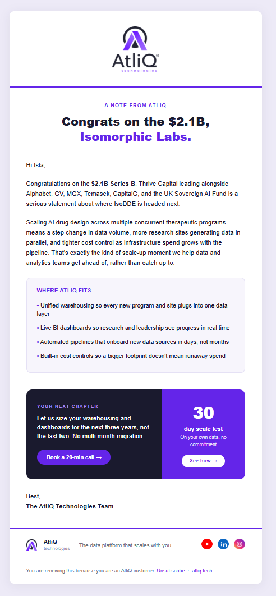

# Codebasics Claude in 60 minutes webinar

Welcome to my Codebasics Learners Week AI project. This repository documents a hands-on build completed during the "Claude in 60 Minutes" webinar, where a real business use case for AtliQ Tech, a cloud data and analytics company, was solved live inside Claude. The project covers cleaning and combining messy multi country sales data, scoring and tiering customers, researching recent funding activity, and generating a branded pitch deck and outreach email, all through prompting alone.

----
## Table of Contents
- [Introduction](#introduction)  
- [Project Description](#project-description)
- [Folder Structure](#Folder-Structure)
- [Key Features](#Key-Features)  
- [Installation](#installation)  
- [Usage](#usage)
- [Visual Insights](#Visual-Insights) 
- [License](#license)

## Introduction

----

*Project Title:* Codebasics Learners Week AI - Claude in 60 minutes  
*Created By:* [Sachin-Analyst](https://github.com/Sachin-Analyst)  
*Tools Used:* Claude, Excel, PowerPoint  
*Focus Areas:* Data Cleaning & Standardization, Customer Tiering, Funding Research, Pitch Deck & Email Generation

----

## Project Description
This repository contains a sales workflow built entirely inside Claude, based on the AtliQ Tech use case from the Codebasics "Claude in 60 Minutes" webinar. Built across four prompting stages
- Data Cleaning, Customer Tiering, Funding Research, and Outreach Generation
- It combines four country level sales files into one clean master file, scores customers on deal value, tenure, and ease of business, tags them as Gold, Silver, or Bronze, researches recent funding for top tier accounts, and produces a branded pitch deck and cold email for a real lead.
- Each stage was driven by a single, specific prompt rather than manual work, showing how Claude's Projects, Skills, and Research capabilities work together on a real workflow.

---

## Folder Structure
- *Prompt* - Every prompt used across the four stages, documented in order (cleaning, tiering, funding research, deck and email)
- *Report* - The finished outputs: the master customer file, the pitch deck, and the outreach email
- *Raw-Data* - The original messy sales files from each country team, before cleaning
- *Style-Guide* - The Colors i have used to build the report

## Key features
- *Multi Country Data Cleaning & Currency Standardization*
- *Weighted Customer Scoring & Tiering*
- *Live Funding Research for Top Accounts*
- *Brand Matched Pitch Deck Generation*
- *Tailored Cold Outreach Email*

## Installation
To explore or replicate this workflow:
1. *Open Claude and Create a Project*
   - Set up a new project and add the AtliQ Tech context under Instructions
2. *Upload the Raw Data*
   - Add the files from the Raw-Data folder into the project's Context
3. *Run the Prompts*
   - Use the prompts from the Prompt folder in order to reproduce the cleaning, tiering, research, and generation steps

   
----

## Usage
### What You Can Explore
- How Claude Cleaned and Standardized Multi Country Data in Minutes, Not Hours
- How Customer Scoring and Tiering Was Automated Instead of Built Manually
- How Funding Research Was Done Instantly Using Claude's Web Search
- How a Branded Pitch Deck and Email Were Generated Without a Designer

----

### Explore the `Prompt`, `Report`, and `Style-Guide` folders for the full logic behind each stage.

----

## Visual Insights
LinkedIn Post - [Linkedin-Post-URL]()  
Webinar Reference - [Codebasics-Webinar-Link](https://www.youtube.com/live/3rBxY1x9rjY?si=C3XDIsY-BP-SMIfx)

----

## License
This project is licensed under the MIT License. See the [LICENSE](LICENSE) file for details
